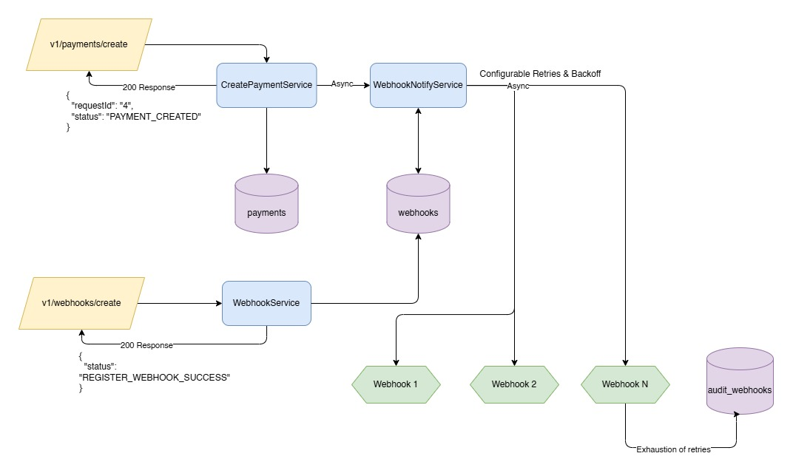

# Payments App

App for managing payments and webhooks

## Installation and Running
### Prerequisites
- Java 21, Spring 3.5.5, PostgreSQL (Supabase)
- An IDE like IntelliJ/Eclipse (with Lombok and MapStruct plugins installed)
1. Clone the repository
2. Update `application.properties` with your Supabase Session Pooler connection string
3. Build the project using `mvn clean install`
4. Run `mvn spring-boot:run`
5. The application will be available at `http://localhost:8080`

The application is also hosted on Koyeb PaaS platform and can be accessed at: https://payment-eg.koyeb.app
- Ensure to update the configuration URL on the Angular front-end to point to this hosted URL (https://payment-eg.koyeb.app) instead of default localhost.

## Testing
- Run tests using `mvn test`
- Attached simple manual testing document in docs/ folder for reference.

### Payloads
- OpenAPI/Swagger documentation is placed in the root of the project (openapi.yaml).
- Can also be accessed directly in Swagger UI at http://localhost:8080/swagger-ui/index.html (local) OR https://payment-eg.koyeb.app/swagger-ui/index.html for detailed API documentation

## Assumptions/Notes
1. Payment flow should be successful irrespective of webhook invocation outcome
2. Card number is sent encrypted to the webhook, can be decrypted by the receiver
3. For the scope of this assignment, the failed webhooks (upon exhaustion of retries) are inserted into an audit table in DB. Can have another job polling the DB and retrying for successful response. Alternatively, there could be a Dead Letter Queue topic onto which these events could be published and retried later by another cron job. These techniques should help ensure resilience.
4. Monitoring/Tracing has not been considered as part of the scope - can be implemented using tools like Prometheus/Grafana/Otel etc.
5. For simplicity, the API key is hardcoded in application.properties. In a real-world scenario, this should be securely managed using a secrets manager or environment variables.
6. The retry mechanism for webhook calls is implemented using Spring Retry with exponential backoff. The configuration can be adjusted in the `application.properties` file.
7. The application uses Lombok to reduce boilerplate code. **IDE would need to be configured to handle Lombok annotations.**
8. The application also used MapStruct for entity-DTO mapping. **IDE would need to be configured to handle MapStruct annotations.**
9. The application does not include pagination or filtering for listing payments or webhooks. These features can be added as needed.
10. The application does not include input validation beyond basic checks. More comprehensive validation should be implemented as needed.
11. Front-end was optional, but has been included for completeness. It is a simple Angular app that allows users to create payments and register webhooks - does not handle complex validations etc.
12. Async Webhook Execution is not displayed on the Angular UI, but can be monitored via logs or DB entries. For a production system, this could be handled using SSE or WebSocket to provide real-time updates to the user.
13. CORS is enabled for all origins for simplicity. In a production system, this should be restricted to trusted domains.

## High Level Architecture
- The system consists of RESTful APIs for creating payments and registering webhooks.
- Payments are stored in a PostgreSQL database. 
  - 3 tables are used - payments, webhooks and failed_webhooks (audit table).
  - Card Number is stored encrypted in the payments table using AES 256 encryption.
- Webhooks are invoked asynchronously using CompletableFuture with retries on failure using Spring Retry. This ensures that the payment creation process is not blocked by slow or failing webhook endpoints.
  - For further scalability, the webhook invocation could be offloaded to a message queue (like RabbitMQ/Kafka) to decouple it from the payment creation process.
- Additionally, components for creation of payments, registration of webhooks, and invocation of webhooks are separated into different service classes to adhere to the Single Responsibility Principle.



### Potential Improvements
- The payment creation, webhook registration, and webhook invocation services can be further broken down into smaller microservices for better scalability and maintainability.
- Use a message broker (like RabbitMQ/Kafka) for webhook invocation to improve reliability and scalability.
- Also, circuit breaker pattern can be implemented using Resilience4j to prevent system overload in case of persistent webhook failures.
- User Interface can be enhanced to provide better user experience and real-time updates on webhook invocation status.
- UI can be deployed separately using a static site hosting service for better performance and scalability.

## API Endpoints
- `POST /v1/payments/create`: Create a new payment
- `POST /v1/webhooks/create`: Register a new webhook

### Create Payment
```POST /v1/payments/create
Content-Type: application/json
X-API-KEY: your_api_key_here
```
```json
{
  "requestId": "4",
  "firstName": "Jane Smith",
  "lastName": "Smith",
  "zipCode": "11",
  "cardNumber": "4242-4242-4242-4242"
}
```
### Response
```json
{
  "requestId": "4",
  "status": "PAYMENT_CREATED"
}
```
### Register Webhook
```POST /v1/webhooks/create
Content-Type: application/json
X-API-KEY: your_api_key_here
```
```json
{
  "url": "https://api.restful-api.dev/objects"
}
```
### Response
```json
{
  "status": "REGISTER_WEBHOOK_SUCCESS"
}
```


## Technologies Used
Backend:
- Language: Java 21, Spring Boot 3.5.5
- DB: PostgreSQL - Supabase
- ORM: Hibernate
- Logging: slf4j
- Entity Mapping: MapStruct
- API Auth: Simple API Key Authentication
- Testing: JUnit/Mockito

Frontend:
- Framework: Angular 19

## Dependencies
- Spring Boot
- Spring Web
- Spring Data JPA
- PostgreSQL Driver
- Lombok
- MapStruct
- Spring Security
- Spring Retry
- Commons Validator

## Docker

A Dockerfile is included for containerization.
